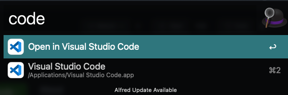
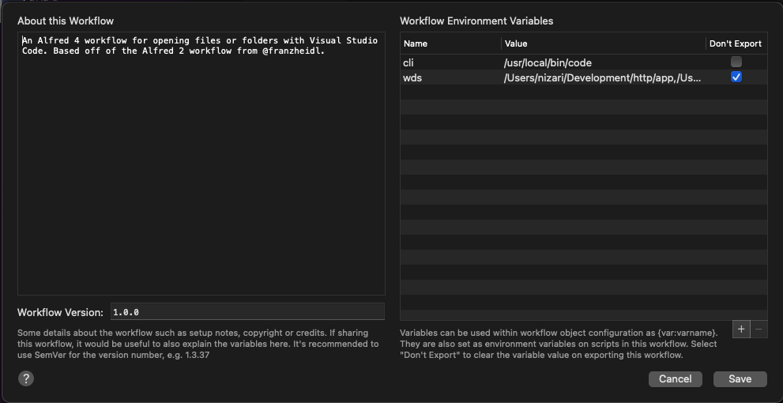
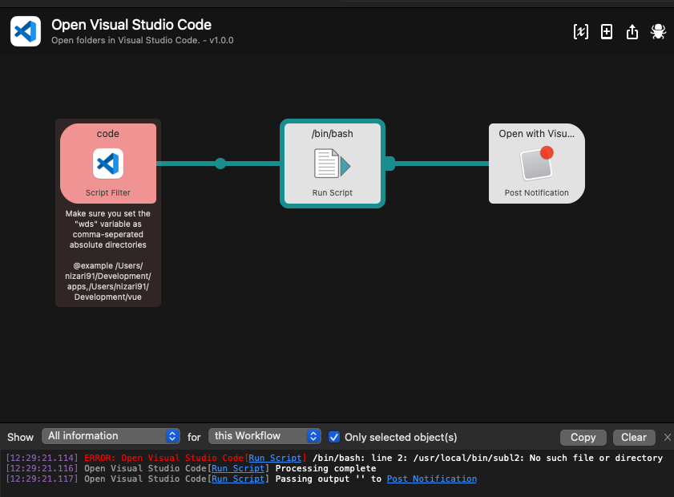

# Alfred Workflow - Open in Visual Studio Code

An [Alfred 4](https://www.alfredapp.com/) workflow opening files or folders with [Visual Studio Code](https://code.visualstudio.com/).



## Installation

1. [Download the latest version](https://github.com/tillkruss/alfred-laravel-docs/releases/download/v0.3.0/Laravel.Docs.alfredworkflow)
2. Install the workflow by double-clicking the `.alfredworkflow` file
3. You can add the workflow to a category, then click "Import" to finish importing. You'll now see the workflow listed in the left sidebar of your Workflows preferences pane.

## Usage

Just type `code` followed by your search query.

```console
code <query>
```

Press `<enter>` to open the directory with your Visual Studio Code.

## Change IDE Editor

You can easily change the IDE in which you open the folder by updating the `cli` execution path.

For example setting it to `/usr/local/bin/subl` will open your directory with Sublime.



## Troubleshoot

### Nothing happens?

In this case open the [Alfred Debugger Utility](https://www.alfredapp.com/help/workflows/utilities/debug/) and see what error is thrown. A common use case can be that your IDE execution file doesn't exist.


